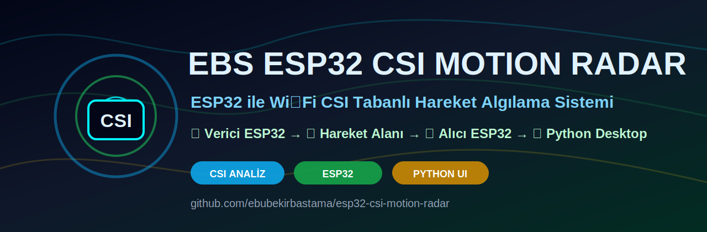
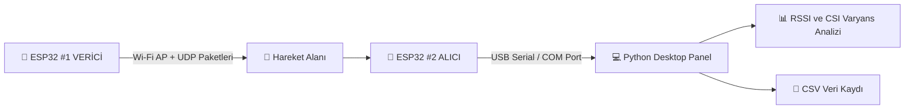

<div align="center">



# 📡 EBS ESP32 CSI Motion Radar

### 🚀 ESP32 ile Wi‑Fi CSI Tabanlı Deneysel Hareket Algılama Sistemi

[](https://github.com/ebubekirbastama/esp32-csi-motion-radar/stargazers)
[](https://github.com/ebubekirbastama/esp32-csi-motion-radar/forks)
[](https://github.com/ebubekirbastama/esp32-csi-motion-radar/watchers)
[](https://github.com/ebubekirbastama/esp32-csi-motion-radar/issues)
[](https://github.com/ebubekirbastama/esp32-csi-motion-radar/pulls)
[](https://github.com/ebubekirbastama/esp32-csi-motion-radar/commits/main)
[](https://github.com/ebubekirbastama/esp32-csi-motion-radar)
[](LICENSE)


### 🔬 Wi‑Fi CSI Sinyal Analizi • 📡 ESP32 Kablosuz Algılama • 💻 Python Desktop Panel

⭐ Projeyi beğendiyseniz GitHub'da yıldız vermeyi unutmayın.

**Repository:**  
https://github.com/ebubekirbastama/esp32-csi-motion-radar

</div>

---

# 📌 İçindekiler

- [Proje Hakkında](#-proje-hakkında)
- [Bu Proje Ne İşe Yarar?](#-bu-proje-ne-işe-yarar)
- [CSI Nedir?](#-csi-nedir)
- [Sistem Mimarisi](#-sistem-mimarisi)
- [Kullanılan Donanımlar](#-kullanılan-donanımlar)
- [Verici ve Alıcı Ayrımı](#-verici-ve-alıcı-ayrımı)
- [Repo Klasör Yapısı](#-repo-klasör-yapısı)
- [Kurulum](#-kurulum)
- [ESP32 Kodlarını Yükleme](#-esp32-kodlarını-yükleme)
- [Python Desktop Kullanımı](#-python-desktop-kullanımı)
- [Veri Formatı](#-veri-formatı)
- [Fiziksel Yerleşim](#-fiziksel-yerleşim)
- [Kalibrasyon](#-kalibrasyon)
- [Yapabilecekleri](#-yapabilecekleri)
- [Yapamayacakları](#-yapamayacakları)
- [Sorun Giderme](#-sorun-giderme)
- [Güvenlik ve Etik Kullanım](#-güvenlik-ve-etik-kullanım)
- [Yol Haritası](#-yol-haritası)
- [Katkı Sağlama](#-katkı-sağlama)
- [Lisans](#-lisans)

---

# 🎯 Proje Hakkında

**EBS ESP32 CSI Motion Radar**, iki adet **ESP32 ESP-32S** geliştirme kartı ile Wi‑Fi sinyal değişimlerini analiz eden deneysel bir hareket algılama sistemidir.

Bu proje klasik PIR sensör, kamera veya mikrofon kullanmaz. Algılama mantığı, iki ESP32 arasındaki Wi‑Fi sinyal alanında oluşan bozulmaları ve değişimleri analiz etmeye dayanır.

Bir ESP32 **verici**, diğer ESP32 **alıcı** olarak çalışır. Verici ESP32 sürekli Wi‑Fi sinyali ve UDP paketleri üretir. Alıcı ESP32 bu sinyalleri alır, CSI verisini okur ve USB üzerinden bilgisayardaki Python uygulamasına gönderir.

---

# 🚀 Bu Proje Ne İşe Yarar?

Bu proje deneysel olarak aşağıdaki amaçlarla kullanılabilir:

✅ Wi‑Fi CSI verisi toplama  
✅ Hareket algılama denemeleri  
✅ Kablosuz sinyal analizi  
✅ ESP32 tabanlı sensör geliştirme  
✅ Python ile gerçek zamanlı veri okuma  
✅ CSI veri seti oluşturma  
✅ Akademik / kişisel AR‑GE çalışmaları  
✅ Yapay zeka ile hareket sınıflandırma altyapısı hazırlama  

> Bu sistem bir güvenlik kamerası değildir. Görüntü oluşturmaz, kişi tanımaz, ses kaydı almaz.

---

# 🧠 CSI Nedir?

**CSI**, yani **Channel State Information**, Wi‑Fi sinyalinin ortamdan geçerken nasıl değiştiğini gösteren düşük seviyeli kablosuz kanal bilgisidir.

Bir insan veya nesne Wi‑Fi sinyal alanından geçtiğinde sinyalde küçük değişiklikler oluşur. Bu değişiklikler CSI verisinde görülebilir.

Örnek değişim kaynakları:

- 🚶 İnsan yürümesi
- 🚪 Kapı açılması
- 🪑 Büyük nesnenin yer değiştirmesi
- 📦 Cisim hareketi
- 🌬️ Ortamdaki fiziksel değişimler

Bu proje, CSI verilerindeki değişimleri analiz ederek hareket olup olmadığını anlamaya çalışır.

---

# 🏗️ Sistem Mimarisi



Basit gösterim:

```text
┌────────────────────┐
│  ESP32 #1 VERİCİ   │
│  Wi‑Fi AP Oluşturur│
└─────────┬──────────┘
          │
          │ Wi‑Fi CSI Sinyal Alanı
          │
          ▼
┌────────────────────┐
│  Hareket Bölgesi   │
│  İnsan / Nesne     │
└─────────┬──────────┘
          │
          ▼
┌────────────────────┐
│  ESP32 #2 ALICI    │
│  CSI Verisi Okur   │
└─────────┬──────────┘
          │ USB Serial
          ▼
┌────────────────────┐
│  Windows Bilgisayar│
│  Python Radar UI   │
└────────────────────┘
```

---

# 🛠️ Kullanılan Donanımlar

| Donanım | Adet | Açıklama |
|---|---:|---|
| ESP32 ESP-32S | 2 | Biri verici, biri alıcı |
| Micro USB veri kablosu | 2 | Programlama ve veri aktarımı |
| Windows bilgisayar | 1 | Python masaüstü uygulaması |
| Arduino IDE | 1 | ESP32 kodlarını yüklemek için |
| Python 3.10+ | 1 | Desktop yazılımı için |

Önerilen kart:

```text
ESP32 ESP-32S WiFi Bluetooth Dual Mode Geliştirme Kartı
ESP32-WROOM-32 modülü
Micro USB bağlantı
```

> İlk kurulumda yan pinleri lehimlemek zorunlu değildir. USB bağlantısı yeterlidir.

---

# 📡 Verici ve Alıcı Ayrımı

## 🟢 ESP32 #1 → VERİCİ

Bu karta şu dosya yüklenir:

```text
esp32_transmitter/esp32_transmitter.ino
```

Görevi:

- Wi‑Fi Access Point oluşturur.
- `EBS_CSI_RADAR` adlı ağı yayınlar.
- UDP paketleri gönderir.
- CSI ölçümü için sinyal kaynağı olur.

Varsayılan bilgiler:

```text
SSID: EBS_CSI_RADAR
Şifre: 12345678
Kanal: 6
UDP Port: 3333
```

Bu kart bilgisayara sürekli bağlı olmak zorunda değildir. Kod yüklendikten sonra USB adaptör veya powerbank ile çalıştırılabilir.

---

## 🔴 ESP32 #2 → ALICI

Bu karta şu dosya yüklenir:

```text
esp32_receiver/esp32_receiver_csi.ino
```

Görevi:

- Verici ESP32'nin oluşturduğu Wi‑Fi ağına bağlanır.
- CSI verisini okur.
- RSSI bilgisini alır.
- Ham CSI verilerini USB Serial üzerinden bilgisayara gönderir.

> Python Desktop uygulaması yalnızca **alıcı ESP32'nin COM portuna** bağlanır.

---

# 📂 Repo Klasör Yapısı

```text
esp32-csi-motion-radar/
│
├── README.md
├── LICENSE
├── requirements.txt
│
├── assets/
│   ├── banner.svg
│   ├── banner.png
│   ├── demo.gif
│   └── logo.svg
│
├── esp32_transmitter/
│   └── esp32_transmitter.ino
│
├── esp32_receiver/
│   └── esp32_receiver_csi.ino
│
├── desktop/
│   ├── desktop_csi_radar.py
│   └── csi_logger.py
│
├── wiki/
│   ├── 01-Kurulum.md
│   ├── 02-Donanim.md
│   ├── 03-Kullanim.md
│   ├── 04-Sorun-Giderme.md
│   └── 05-Gelistirme-Notlari.md
│
├── CONTRIBUTING.md
├── CHANGELOG.md
└── SECURITY.md
```

---

# ⚙️ Kurulum

## 1️⃣ Arduino IDE Kurulumu

Arduino IDE programını kurun.

Arduino IDE içinde:

```text
File > Preferences
```

bölümüne girin.

**Additional Boards Manager URLs** alanına şu adresi ekleyin:

```text
https://raw.githubusercontent.com/espressif/arduino-esp32/gh-pages/package_esp32_index.json
```

Sonra:

```text
Tools > Board > Boards Manager
```

bölümüne girin.

Arama kısmına:

```text
esp32
```

yazın ve şu paketi kurun:

```text
esp32 by Espressif Systems
```

---

## 2️⃣ Arduino IDE Kart Ayarları

Önerilen ayarlar:

```text
Board: ESP32 Dev Module
Upload Speed: 115200 veya 921600
CPU Frequency: 240 MHz
Flash Frequency: 80 MHz
Port: Kendi COM portunuz
```

ESP32 bilgisayarda görünmüyorsa CP2102 USB sürücüsü gerekebilir.

---

# 📥 ESP32 Kodlarını Yükleme

## 🟢 Verici ESP32 Kodunu Yükleme

1. Birinci ESP32 kartı bilgisayara takın.
2. Arduino IDE'de şu dosyayı açın:

```text
esp32_transmitter/esp32_transmitter.ino
```

3. Doğru COM portu seçin.
4. Upload butonuna basın.
5. Yükleme sonrası kart şu ağı oluşturur:

```text
EBS_CSI_RADAR
```

---

## 🔴 Alıcı ESP32 Kodunu Yükleme

1. İkinci ESP32 kartı bilgisayara takın.
2. Arduino IDE'de şu dosyayı açın:

```text
esp32_receiver/esp32_receiver_csi.ino
```

3. Doğru COM portu seçin.
4. Upload butonuna basın.
5. Kart verici ESP32 ağına bağlanır.
6. CSI verisini USB üzerinden bilgisayara göndermeye başlar.

---

# 💻 Python Desktop Kullanımı

## Python Bağımlılıkları

Terminal veya CMD açın:

```bash
pip install -r requirements.txt
```

Alternatif:

```bash
pip install pyserial numpy
```

---

## COM Port Bulma

Windows üzerinde:

```text
Aygıt Yöneticisi > Bağlantı Noktaları COM ve LPT
```

bölümünden ESP32 portunu bulun.

Örnek:

```text
COM5
```

---

## CSI Logger Çalıştırma

Ham CSI verilerini CSV olarak kaydetmek için:

```bash
python desktop/csi_logger.py
```

Bu uygulama gelen verileri CSV dosyasına kaydeder.

---

## Desktop Radar Panelini Çalıştırma

Gerçek zamanlı panel için:

```bash
python desktop/desktop_csi_radar.py
```

Panelde şunlar görüntülenir:

- 📶 RSSI değeri
- 📈 CSI varyans değeri
- 🚶 Hareket algılama sonucu
- 📋 Olay listesi
- 💾 CSV kayıt

---

# 📊 Veri Formatı

Örnek CSI çıktısı:

```text
12450,-43,128,12,-5,33,18,-9,...
```

Açıklama:

| Alan | Açıklama |
|---|---|
| `12450` | ESP32 çalışma zamanı / millis |
| `-43` | RSSI değeri |
| `128` | CSI veri uzunluğu |
| `12,-5,33...` | Ham CSI değerleri |

---

# 🔌 Fiziksel Yerleşim

Önerilen ilk test düzeni:

```text
[ESP32 VERİCİ]  ----  2-5 metre  ----  [ESP32 ALICI]  ---- USB ----  [PC]
```

Dikkat edilmesi gerekenler:

- İki kart sabit durmalıdır.
- Hareket iki kart arasında olmalıdır.
- Fan, klima, motor gibi titreşim kaynakları ölçümü etkileyebilir.
- Başlangıçta 2-5 metre arası mesafe önerilir.
- Cihazlar masa hizasında yerleştirilebilir.

---

# 🎚️ Kalibrasyon

Başlangıç eşik değeri:

```text
8.0
```

Sistem sürekli hareket algılıyorsa:

```text
Eşik değerini artırın.
```

Sistem hareket algılamıyorsa:

```text
Eşik değerini azaltın.
```

Kalibrasyon için önerilen test sırası:

1. Boş odada cihazları sabit bırakın.
2. Varyans değerini gözlemleyin.
3. İki kart arasından yürüyün.
4. Hareket anındaki varyans değerini gözlemleyin.
5. Eşik değerini bu iki durum arasına ayarlayın.

---

# ✅ Yapabilecekleri

Bu proje deneysel olarak şunları yapabilir:

- Hareket algılama
- Geçiş tespiti
- CSI veri toplama
- RSSI izleme
- Wi‑Fi sinyal değişim analizi
- Aktivite değişimi gözlemleme
- CSV veri seti oluşturma
- Yapay zeka için ham veri hazırlama

---

# ❌ Yapamayacakları

Bu proje güvenilir şekilde şunları yapamaz:

- Kişi kimliği tespiti
- Yüz tanıma
- Ses kaydı
- Kamera görüntüsü oluşturma
- Santimetre hassasiyetinde konum belirleme
- Kesin oda haritası çıkarma
- Garanti duvar arkası insan tespiti
- Profesyonel güvenlik sistemi yerine geçme

---

# 🔧 Sorun Giderme

## ESP32 COM Portta Görünmüyor

Çözüm:

- Micro USB veri kablosu kullanın.
- Bazı USB kabloları sadece şarj içindir.
- CP2102 USB sürücüsünü kurun.
- Farklı USB port deneyin.
- Aygıt Yöneticisi'ni kontrol edin.

---

## Verici Wi‑Fi Ağı Görünmüyor

Kontrol edin:

- Verici karta doğru kod yüklendi mi?
- Kart güç alıyor mu?
- Serial Monitor'da hata var mı?
- Kart resetleniyor mu?

---

## Alıcı Bağlanmıyor

Kontrol edin:

```text
SSID: EBS_CSI_RADAR
Şifre: 12345678
```

Ayrıca:

- Verici açık mı?
- Alıcıya doğru kod yüklendi mi?
- İki kart birbirine çok uzak mı?

---

## CSI Verisi Gelmiyor

Kontrol edin:

- Alıcı ESP32 USB ile PC'ye bağlı mı?
- Python uygulamasında doğru COM port seçili mi?
- Baud rate 115200 mü?
- Arduino Serial Monitor açık kalmış mı? Aynı COM portu iki uygulama aynı anda kullanamaz.

---

## Sürekli Hareket Algılıyor

Çözüm:

- Eşik değerini artırın.
- Kartları sabitleyin.
- Fan, klima, motor gibi hareketli kaynaklardan uzaklaştırın.
- Ortamı daha stabil hale getirin.

---

## Hareket Algılamıyor

Çözüm:

- Eşik değerini azaltın.
- Cihazlar arası mesafeyi azaltın.
- Hareketin iki kart arasında olduğundan emin olun.
- Alıcı ve vericiyi aynı yükseklikte tutun.

---

# 🔐 Güvenlik ve Etik Kullanım

Bu proje eğitim, araştırma ve deneysel amaçlıdır.

Kullanım ilkeleri:

- İnsanları bilgisi veya izni olmadan izlemek için kullanmayın.
- Projeyi yalnızca izinli alanlarda kullanın.
- Kamera veya mikrofon içermese bile mahremiyet ilkelerine dikkat edin.
- Profesyonel güvenlik sistemi olarak kullanmadan önce kapsamlı test yapın.

---

# 🛣️ Yol Haritası

Planlanan geliştirmeler:

- [ ] Gerçek zamanlı grafik paneli
- [ ] CSI veri temizleme
- [ ] Otomatik eşik kalibrasyonu
- [ ] Makine öğrenmesi ile hareket sınıflandırma
- [ ] Çoklu ESP32 desteği
- [ ] MQTT entegrasyonu
- [ ] Web tabanlı panel
- [ ] SQLite / MySQL kayıt sistemi
- [ ] Isı haritası benzeri görselleştirme
- [ ] JSON API desteği

---

# 📜 Lisans

Bu proje MIT lisansı ile yayınlanmıştır.

Detaylar için:

```text
LICENSE
```

dosyasını inceleyin.

---

<div align="center">

## ⭐ Projeyi Destekle

Bu proje işinize yaradıysa GitHub'da yıldız vermeyi unutmayın.

https://github.com/ebubekirbastama/esp32-csi-motion-radar

📡 ESP32 • 📶 Wi‑Fi CSI • 💻 Python • 🔬 Deneysel Radar

</div>
